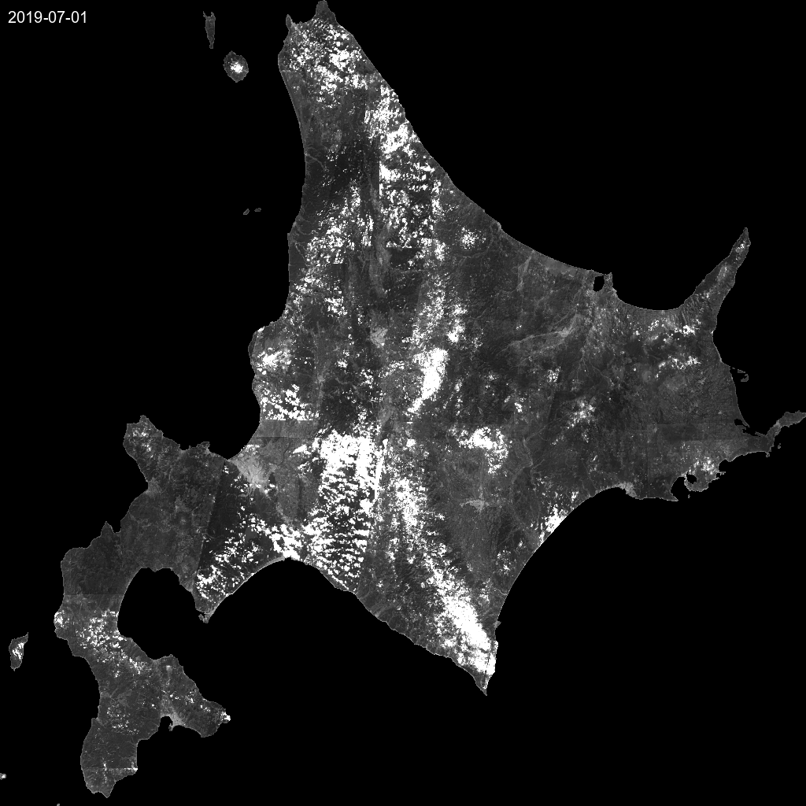

# Timelapse Generator

The **Timelapse Generator** is a tool designed to visualize changes over time by creating animated GIFs from a sequence of georeferenced satellite images (GeoTIFFs).

This is particularly useful for analyzing:

- Deforestation over time.
- Urban expansion.
- Water level changes in reservoirs.
- Seasonal vegetation changes.

## Example Output



## Features

- **Automatic Sorting**: Automatically sorts images by filename or date.
- **Date Extraction**: Extracts dates from filenames (e.g., Sentinel-2 convention) to overlay on the animation.
- **Normalization**: Automatically normalizes 16-bit satellite data to 8-bit visual range using percentile clipping (2% - 98%) to ensure good contrast.
- **Customizable**: Adjust FPS, resizing, and timestamp visibility.

## Usage

```python
from solafune_tools.community_tools.timelapse import create_timelapse

# Define input directory containing .tif files
input_dir = "data/tif/my_area_B04"
output_file = "my_area_b04_timelapse.gif"

# Generate Timelapse
create_timelapse(
    input_dir=input_dir,
    output_filename=output_file,
    fps=5,                  # 5 frames per second
    add_timestamp=True,     # Overlay date
    resize_factor=0.5       # Reduce size by 50% for smaller file
)
```

## API Reference

### `create_timelapse`

```python
def create_timelapse(
    input_dir: str,
    output_filename: str,
    fps: int = 5,
    add_timestamp: bool = True,
    text_color: str = "white",
    resize_factor: float = 1.0
) -> str
```

| Parameter         | Type    | Default   | Description                                              |
| ----------------- | ------- | --------- | -------------------------------------------------------- |
| `input_dir`       | `str`   | N/A       | Directory containing source `.tif` files.                |
| `output_filename` | `str`   | N/A       | Path where the output GIF will be saved.                 |
| `fps`             | `int`   | `5`       | Frames per second for the animation.                     |
| `add_timestamp`   | `bool`  | `True`    | Whether to draw the date on the frame.                   |
| `text_color`      | `str`   | `"white"` | Color of the timestamp text.                             |
| `resize_factor`   | `float` | `1.0`     | Scale factor to resize images (e.g., 0.5 for half size). |

## Dependencies

- `rasterio`: For reading GeoTIFFs.
- `Pillow` (PIL): For image processing and creating GIFs.
- `numpy`: For array manipulation and normalization.
